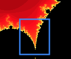

# Unexpected JavaScript Performance Issue

This repo illustrates a reproducible, but unexpected JavaScript performance issue related to partial functions and `for` loops.

This issue only occurs in browsers using the V8 JavaScript engine - Google Chrome or Brave.  Im my case, I discovered this issue when testing using the Brave browser.

## Steps to reproduce the problem

1. Clone this repo into some development directory.  To start with, this JavaScript performance problem has been coded around, so the performance seen below is the expected response time

1. Start a local web server using this repo as the document root directory.  In my testing, I've been using Python's built-in Web server
    
    ```bash
    $ python3 -m http.server
    Serving HTTP on 0.0.0.0 port 8000 (http://0.0.0.0:8000/) ...
    ```

1. You need to have the browser developer tools switched on during this test to ensure that no caching takes place

1. Point your to [http://0.0.0.0:8000/](http://0.0.0.0:8000/) and press "j" to select calculation using JavaScript instead of WebAssembly

1. On the image of the Mandelbrot set, move the mouse pointer around in the narrow gap between the main cardioid and the period 2 bulb

    

1. You will see that as ypou move the mouse pointer, the corresponding Julia set is displayed below the Mandelbrot set.

    Notice that the calculation time is somewhere between 20 and 40 milliseconds
    
1. Now open the JavaScript file [fractal.js](./js/fractal.js#L205) and locate function `JuliaCalcJS` on line 205

1. Move the `for` loop statement on line 219 down to line 224 so that it follows the declaration of the two functions `juliaXStepFn` and `juliaYStepFn`

    Change
    
    ```Javascript
    for (let iy = 0; iy < cvs.height; ++iy) {
      // This is really weird...
      // The following two functions only need to be created once per Julia Set; however, if the two declarations below
      // are moved outside the scope of this for loop, then the performance takes a significant nose-dive
      let juliaXStepFn = makeJuliaXStepFn(juliaSpace.mandelXCoord)
      let juliaYStepFn = makeJuliaYStepFn(juliaSpace.mandelYCoord)
    ```
    
    So that it becomes
    
    ```Javascript
    // This is really weird...
    // The following two functions only need to be created once per Julia Set; however, if the two declarations below
    // are moved outside the scope of this for loop, then the performance takes a significant nose-dive
    let juliaXStepFn = makeJuliaXStepFn(juliaSpace.mandelXCoord)
    let juliaYStepFn = makeJuliaYStepFn(juliaSpace.mandelYCoord)

    for (let iy = 0; iy < cvs.height; ++iy) {
    ```
    
1. Now refresh the browser page and move the mouse pointer within the same area of the Mandelbrot set

1. The time taken to calculate the corresponding Julia now rises to in excess of 90ms.  That's weird...

## Aside...

After optimising the JavaScript coding (in [fractal_new.js](./js/fractal_new.js)), this strange performance problem no longer happens


